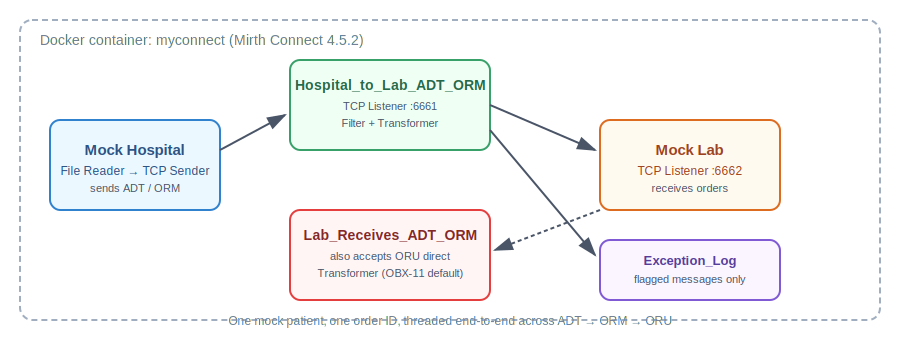
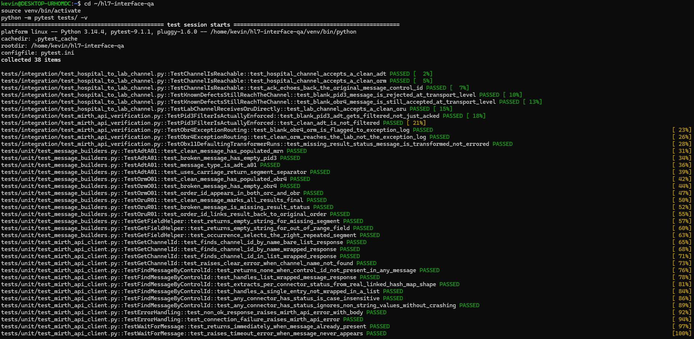
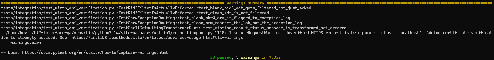

# HL7 Interface Engine QA — Manual → Automated

[](https://github.com/korara78/hl7-interface-qa/actions/workflows/tests.yml)



A local healthcare interoperability lab built on **Mirth NextGen Connect**, with a
**Python/pytest** automation layer on top. It simulates a hospital sending patient
admissions (ADT) and lab orders (ORM), and a lab system sending back results (ORU),
routed through a real interface engine over the actual MLLP protocol hospitals use.

This project exists to answer one question concretely: *can this person move from
manually clicking through test cases to actually automating them?*

**Proof, not just a claim:** unlike a UI project, there's nothing to click through here
to see it work — the test output *is* the deliverable. This is a real run against a
live Mirth instance, not a mock:





See `docs/05_running_the_python_test_suite.md` if you want to reproduce this yourself.

## Why this project

Three real-world defects show up constantly in interface engineering, and they all
share the same nasty property: **they parse as perfectly valid HL7**, so a naive
"does it parse" test won't catch any of them.

| Defect | Field | Consequence if it ships |
|---|---|---|
| Blank MRN | PID-3 | Patient can't be matched → duplicate chart created |
| Blank test code | OBR-4 | Lab receives an order with no test named on it |
| Missing result status | OBX-11 | Clinician can't tell preliminary from final results |

The Mirth side of this project builds Filter/Transformer logic that catches all
three (reject, flag-to-exception-log, and safe-default respectively). The Python
side automates proving that behavior, instead of re-testing it by hand every time.

## Architecture

```
 [pytest test suite]
        |
        | MLLP / TCP (port 6661)
        v
 [Hospital_to_Lab_ADT_ORM]  --Filter: reject blank PID-3--
        |                   --Transformer: flag blank OBR-4--
        v
    [Mock Lab]  <-- port 6662 -->  [pytest test suite]
                                    --Transformer: default missing OBX-11 to 'P'--
```

## Repo layout

```
├── docs/                    Step-by-step setup guides (Docker, channels, test data, filters)
├── src/hl7_qa/
│   ├── mllp_client.py       Minimal MLLP client (real TCP socket, no external HL7 lib)
│   ├── messages.py          Builds clean + intentionally defective test messages
│   └── mirth_api_client.py  Mirth Administrator REST API client — verifies actual
│                            Filter/Transformer outcomes (Filtered/Transformed/Sent),
│                            not just the transport-level ACK
├── tests/
│   ├── unit/                No live Mirth needed — message builders + API client
│   │                        parsing logic, verified against mocked HTTP responses
│   └── integration/         Live tests against a running Mirth instance
├── requirements.txt
└── pytest.ini
```

## Running it

**Unit tests** (no setup required):
```bash
pip install -r requirements.txt
pytest tests/unit -v
```

**Integration tests** (requires Mirth running locally — see `docs/01_local_environment_setup.md`):
```bash
pytest tests/integration -v
```
If Mirth isn't running, these skip cleanly with a message telling you why, rather
than failing with a raw connection error.

## What the integration tests prove

Two layers, deliberately kept separate:

- **`test_hospital_to_lab_channel.py`** — MLLP-only. Confirms the channels are up,
  listening, and accept well-formed traffic. An ACK proves *receipt*, nothing more.
- **`test_mirth_api_verification.py`** — MLLP send **+** a follow-up call to Mirth's
  REST API to check what actually happened to that specific message. This is what
  proves the real behavior this project is built around:
  - a blank-PID-3 ADT is genuinely **Filtered**, not just accepted
  - a blank-OBR-4 order is routed to **Exception_Log**, not silently sent to the lab
  - a missing-OBX-11 result is **Transformed** cleanly rather than erroring out

**Status: all 38 tests (unit + integration) pass against a real, running Mirth 4.5.2
instance.** Getting there took five real, distinct fixes — a missing auth header, a
wrong assumption about MLLP ACKs, two wrong guesses at a nested JSON shape, and one
wrong assumption about what "Filtered" means across different connectors in the same
channel. Every one was found by actually running the suite against a live server, not
by guessing harder. The full blow-by-blow is in `docs/06_troubleshooting_log.md` —
worth reading if you're extending this and hit something similar.

## Continuous Integration

Every push to `main` and every pull request automatically runs the **full** suite —
unit and integration — via GitHub Actions
([`.github/workflows/tests.yml`](.github/workflows/tests.yml)). Unlike the local setup,
the integration tests run against a Mirth instance spun up fresh inside the CI job
itself (as a service container), not a persisted local Docker volume — so the workflow
also imports and deploys the two channels from `mirth-config/` before running
`pytest tests/integration -v`. See `docs/07_cicd_concepts_and_branching.md` and
`docs/08_github_actions_ci_setup.md` for the full walkthrough of how this is wired up
and why.

**Confirmed working, not just configured:** all 38 tests pass in CI against a Mirth
instance rebuilt entirely from scratch on every run — no persisted state, no manual
setup carried over. Getting there took one more real fix, on top of the five in
`docs/06_troubleshooting_log.md`: Mirth's channel-deploy endpoint silently rejects a
JSON body and expects a query parameter instead, found only by running it for real in
GitHub Actions.

## Next steps (in progress)

- **Read back actual transformed content** — right now the OBX-11 test confirms the
  Transformer ran without erroring; the next layer is pulling the *transformed*
  message content itself via the API and asserting OBX-11 literally reads `P`.
- **LOINC/code-mapping tests** as the Transformer logic grows.

## Background docs

The `docs/` folder has the full walkthrough this automation sits on top of, as six
sequential guides:

1. **Local environment setup** — Docker, WSL2, Mirth Connect install
2. **Mock hospital & lab channels** — building the two MLLP channels
3. **Mock patient data** — ADT, ORM, and ORU messages for one threaded patient
4. **Filters and transformers** — the actual interface-analyst logic: reject, flag, default
5. **Running the Python test suite** — setup, prerequisites, and how to run it
6. **Troubleshooting log** — every real issue hit setting this up, with cause and fix

Guides 1–4 include diagrams (`docs/images/`) illustrating the architecture, channel
anatomy, message lifecycle, and the defect-handling decision flow.

Also in `docs/`: **`hl7_practice_messages.md`** — three standalone pairs of clean vs.
defective HL7 messages (ADT, ORU, ORM), each with a written answer key. These use a
different mock patient than the main automated thread and aren't wired into pytest —
they're meant for manual practice, e.g. pasting into Mirth Administrator's "Send
Message" dialog to sanity-check the Filter/Transformer logic by eye, or for talking
through the defects out loud in an interview.
