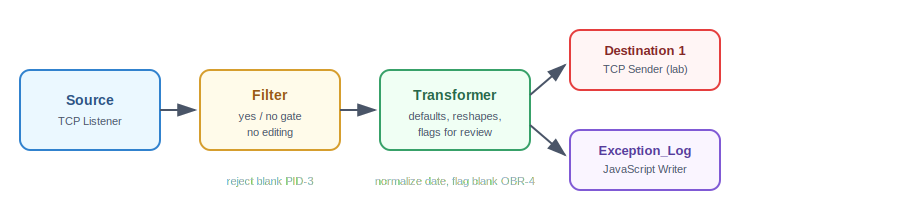

# Part 2: Creating the Mock Hospital & Lab Channels

**Prerequisite:** Part 1 complete — Mirth Connect 4.5.2 running via Docker, Administrator client logged in.

---

## The concept

In a real hospital, you'd have separate physical systems: an EHR system (the "hospital")
sending patient admissions (ADT) and lab orders (ORM), and a Lab Information System
sending back results (ORU). We don't have real separate systems, so we simulate this
using **two channels** that talk to each other over real TCP/MLLP connections — the same
protocol real hospital interfaces use.

```
[Mock Hospital]  --ADT, ORM-->  [Channel 1: Hospital→Lab]  --forwards-->  [Mock Lab]
```

Every channel shares the same basic shape, regardless of what it's routing:



> 💡 **Naming convention tip: whose perspective are you naming from?**
> A common point of confusion in interface engineering: channel names like "Inbound" or
> "Outbound" are usually from **the engine's perspective**, not the sending system's. An
> "Inbound" channel means messages are coming *into* the engine — even though from the
> hospital's point of view, they're sending that data *out*. This guide names channels by
> **data flow direction** instead (e.g., `Hospital_to_Lab_ADT_ORM`), which stays clear
> regardless of whose perspective you're reading from.

---

## Step 1: Create the Hospital channel

1. In the Administrator, click **Channels** → **New Channel**
2. Name it `Hospital_to_Lab_ADT_ORM` directly in the **Name** field on the Summary tab

> 💡 **Tip: no separate "create" dialog.** Unlike some apps, Mirth Connect's "New
> Channel" immediately opens a full channel editor — there's no separate naming popup.
> Type the name into the Summary tab, then save your work via **right-click the channel
> tab → Save** (or the save icon in the toolbar).

### Configure the Source (receives from the "hospital")

3. Click the **Source** tab. It defaults to **Channel Reader**, which only accepts
   messages from other channels inside Mirth — not from an outside system.
4. Change **Connector Type** to **TCP Listener** (the modern equivalent of what older
   versions called "LLP Listener" — same underlying MLLP protocol).
5. Configure:
   - **Local Port:** `6661`
   - **Transmission Mode:** `MLLP`
   - **Mode:** `Server` (this side waits for incoming connections)

Notice the **MLLP Sample Frame**: `<VT> <Message Data> <FS><CR>` — this is the standard
byte-wrapper real HL7 traffic uses (start byte `0x0B`, end bytes `0x1C 0x0D`).

### Configure the Destination (forwards to the "lab")

6. Click the **Destinations** tab. It defaults to **Channel Writer**, which only
   forwards messages internally between channels.
7. Change **Connector Type** to **TCP Sender**. Configure:
   - **Transmission Mode:** `MLLP`
   - **Mode:** `Client` (this side reaches out to connect)
   - **Remote Address:** `127.0.0.1`
   - **Remote Port:** `6662` (this is the Lab channel's listening port, configured next)
8. Save the channel.

---

## Step 2: Create the Lab channel

1. **New Channel** → name it `Lab_Receives_ADT_ORM`
2. **Source tab:** Connector Type → **TCP Listener**, Transmission Mode → **MLLP**,
   **Local Port: `6662`**, Mode → **Server**
3. **Destinations tab:** leave the default **Channel Writer** — for now, this simply
   represents the lab "receiving" the order. Building the actual ORU result-generating
   logic is covered in Part 4 (transformers), since a real lab system doesn't just echo
   messages — it generates new results based on tests performed.
4. Save.

### Port map (keep this handy)

| Port | Role |
|------|------|
| 6661 | Hospital channel listens here (Source) |
| 6662 | Lab channel listens here (Source); Hospital channel's Destination sends here |

---

## Step 3: Deploy both channels

1. Go to **Channels**, select both (Ctrl+click), right-click → **Deploy Channel**
2. Check the **Dashboard** — both should show status **Started**, connection **Idle**
   (meaning actively listening, not disconnected)

---

## Step 4: Test the pipeline

### Method 1 — Mirth's built-in Send Message dialog

This is the fastest way to confirm your destination/transformer logic works, but it has
an important limitation explained below.

1. Go to **Dashboard**, right-click `Hospital_to_Lab_ADT_ORM` → **Send Message**
2. Paste a sample ADT message:

```
MSH|^~\&|HOSPITAL|MAINCAMPUS|LAB|LABSYSTEM|20260705165500||ADT^A01|MSG00001|P|2.3
EVN|A01|20260705165500
PID|1||MRN100001^^^HOSPITAL^MR||DOE^JANE^A||19850315|F|||123 MAIN ST^^PHOENIX^AZ^85001||6235551234
PV1|1|I|WARD1^101^A|||||1234^SMITH^JOHN^A|||||||||||1
```

3. Click **Process Message**
4. Check the Dashboard — both channels should show Received: 1, Sent: 1.

> ⚠️ **Important limitation:** the Send Message dialog injects the message directly into
> the channel's internal processing, **bypassing the actual TCP/MLLP network listener**.
> It's great for testing destination/transformer logic, but it doesn't prove your
> listener actually works over a real network connection. For that, use Method 2.

### Method 2 — A real TCP/MLLP connection via PowerShell

This proves the entire pipeline works exactly as a real hospital system would connect: a
genuine socket, proper MLLP byte-framing, and a real acknowledgment response.

```powershell
$client = New-Object System.Net.Sockets.TcpClient("127.0.0.1", 6661)
$stream = $client.GetStream()
$hl7 = "MSH|^~\&|HOSPITAL|MAINCAMPUS|LAB|LABSYSTEM|20260705170000||ADT^A01|MSG00002|P|2.3`rEVN|A01|20260705170000`rPID|1||MRN100002^^^HOSPITAL^MR||SMITH^JOHN^B||19900101|M|||456 OAK AVE^^PHOENIX^AZ^85002||6235559876`rPV1|1|I|WARD2^205^B|||||5678^JONES^MARY^R|||||||||||2"
$MLLP_START = [byte]0x0B
$MLLP_END = [byte]0x1C
$CR = [byte]0x0D
$bytes = [System.Text.Encoding]::ASCII.GetBytes($hl7)
$stream.WriteByte($MLLP_START)
$stream.Write($bytes, 0, $bytes.Length)
$stream.WriteByte($MLLP_END)
$stream.WriteByte($CR)
$stream.Flush()
Start-Sleep -Milliseconds 500
$buffer = New-Object byte[] 1024
$read = $stream.Read($buffer, 0, $buffer.Length)
[System.Text.Encoding]::ASCII.GetString($buffer, 0, $read)
$client.Close()
```

> ⚠️ **Common pitfall — port not published.** If you see `No connection could be made
> because the target machine actively refused it`, your Docker container likely wasn't
> started with ports 6661/6662 published to the host. The fix is to recreate the
> container with all four ports and (critically) a persistent volume — see Part 1.

A successful run returns a real HL7 **ACK** (acknowledgment) message:

```
MSA|AA|MSG00002BSYSTEM|HOSPITAL|MAINCAMPUS|20260706002951.712||ACK|20260706002951.712|P|2.3
```

- `MSA|AA|` — **AA** means "Application Accept" (success). `AE` (Error) or `AR` (Reject)
  would indicate a problem.
- `MSG00002` — echoes back your original message's control ID, confirming which message
  is being acknowledged.

---

## ⚠️ A costly lesson: Docker data persistence

If you ever recreate your container without a mounted volume attached, **all of Mirth's
data — channels, users, database — is wiped**, since it all lives inside that specific
container's filesystem. Deleting the container deletes everything with it.

**The fix**, already folded into Part 1's setup instructions: always run the container
with a named volume mounted at Mirth's data directory. With that in place, the container
can be freely stopped, restarted, or recreated without losing channels, users, or
settings.

---

## Understanding the Received/Sent counters

After running the PowerShell test, the dashboard may show the Hospital channel with
**Received: 2, Sent: 2** — not 1 and 1 as you might expect on first glance. Expanding the
channel to see its Source and Destination rows separately explains why:

- **Source row:** Received 1 (your message came in), Sent 1 (the automatic ACK response
  going back out to the sender)
- **Destination row:** Received 1 (internally, from the Source stage), Sent 1 (pushed out
  over TCP to the Lab channel)
- **Channel-level totals** are simply the sum across both rows (1+1=2 each) — not a
  separate meaningful count of their own.

The lesson: always check the expanded Source/Destination rows when debugging message
counts, not just the channel-level summary.

---

Both channels are now built, deployed, and proven to work over a real network
connection. Next up: **Part 3 — Creating Mock Patient Data (ADT, ORU, ORM)**.
