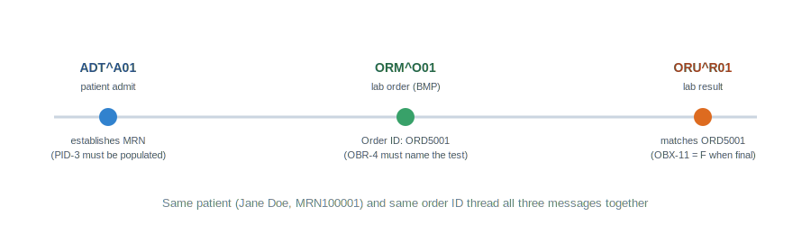

# Part 3: Creating Mock Patient Data (ADT, ORU, ORM)

**Prerequisite:** Part 2 complete — `Hospital_to_Lab_ADT_ORM` and `Lab_Receives_ADT_ORM` channels deployed and tested.

---

## The concept

Plumbing is only half the job — now we need believable data to push through it. The
messages in this guide all describe the **same fictional patient**, moving through the
same admit → order → result lifecycle a real patient's data would follow:



Using one consistent patient across all three message types is what makes this a genuine
end-to-end test, rather than three disconnected samples.

## Quick segment legend

| Segment | Meaning |
|---|---|
| `MSH` | Message header — who sent it, message type, timestamp |
| `EVN` | Event info (used only with ADT messages) |
| `PID` | Patient identification — name, DOB, sex, MRN |
| `PV1` | Patient visit info — location, attending provider |
| `ORC` | Order control — new/cancel/hold, order ID |
| `OBR` | Observation request — what test/procedure was ordered |
| `OBX` | Observation result — the actual value, with type and status |

> 💡 **Why some segments only appear in some message types.** EVN and PV1 are specific to
> ADT (admit/discharge/transfer) messages — they record hospital-stay context that simply
> doesn't apply to an order or a result. An ORM only needs ORC (the order itself) and OBR
> (what's being ordered); it doesn't carry visit or event info. Recognizing *why* a
> message type carries the segments it does — not just memorizing which fields go where —
> is what separates understanding HL7 from just copy-pasting it.

## Our mock patient

| Field | Value |
|---|---|
| Name | Jane A. Doe |
| Date of birth | March 15, 1985 |
| Sex | F |
| MRN | MRN100001 (assigning authority: HOSPITAL) |
| Order | Basic Metabolic Panel, Order ID `ORD5001` |

---

## Message 1: ADT^A01 (patient admit)

This is the message that establishes the patient's record everywhere downstream:

```
MSH|^~\&|HOSPITAL|MAINCAMPUS|LAB|LABSYSTEM|20260706090000||ADT^A01|MSG10001|P|2.3
EVN|A01|20260706090000
PID|1||MRN100001^^^HOSPITAL^MR||DOE^JANE^A||19850315|F|||123 MAIN ST^^PHOENIX^AZ^85001||6235551234
PV1|1|I|WARD1^101^A|||||1234^SMITH^JOHN^A|||||||||||1
```

## Message 2: ORM^O01 (lab order)

Sent by the mock hospital to request a Basic Metabolic Panel for this same patient.

```
MSH|^~\&|CPOE|MAINCAMPUS|LAB|LABSYSTEM|20260706093000||ORM^O01|MSG10002|P|2.3
PID|1||MRN100001^^^HOSPITAL^MR||DOE^JANE^A||19850315|F
ORC|NW|ORD5001|||||||20260706093000
OBR|1|ORD5001||BMP^BASIC METABOLIC PANEL^L|||20260706093000
```

### Sending it

1. Dashboard → right-click **Hospital_to_Lab_ADT_ORM** → **Send Message**
2. Paste the message above → **Process Message**

> ℹ️ Counts here are cumulative across everything sent to a channel, not just the latest
> message — a channel that already processed the ADT will show its ORM count stacked on
> top, not reset to zero. Always confirm the actual message content (next step) rather
> than trusting counts alone.

### Verifying the actual content

Numbers matching up is a good sign, but it's not proof the *right* message went through —
a malformed message could still increment a counter.

1. Right-click **Lab_Receives_ADT_ORM** → **View Messages**
2. Open the most recent message and confirm the raw content

This view is genuinely useful beyond just testing — it's exactly how you'd troubleshoot a
stuck or failed message in a real production interface.

---

## Message 3: ORU^R01 (lab result)

The final piece of the lifecycle: the lab reporting back results for order `ORD5001`.

```
MSH|^~\&|LAB|LABSYSTEM|CPOE|MAINCAMPUS|20260706100000||ORU^R01|MSG10003|P|2.3
PID|1||MRN100001^^^HOSPITAL^MR||DOE^JANE^A||19850315|F
OBR|1|ORD5001|FIL5001|BMP^BASIC METABOLIC PANEL^L|||20260706093000
OBX|1|NM|2345-7^GLUCOSE^LN|1|92|mg/dL|70-99|N|||F
OBX|2|NM|2951-2^SODIUM^LN|2|140|mmol/L|136-145|N|||F
OBX|3|NM|2823-3^POTASSIUM^LN|3|4.1|mmol/L|3.5-5.1|N|||F
```

> 💡 **New field to notice: OBR-3, the Filler Order Number (`FIL5001`).** This is the
> *lab's own* internal ID for the order, distinct from `ORD5001` (the *hospital's* order
> ID, in OBR-2). Real systems track both — each side of the interface has its own
> numbering scheme, and the two IDs are how a result gets correctly matched back to its
> original order.

### Understanding the OBX segment, field by field

```
OBX|1|NM|2345-7^GLUCOSE^LN|1|92|mg/dL|70-99|N|||F
    1  2  3                4  5  6     7    8 9 10 11
```

| Position | Field | Example value | Meaning |
|---|---|---|---|
| 1 | Set ID | `1` | Sequence number within this message |
| 2 | Value Type | `NM` | Numeric (vs. `ST` for string/text, `CE` for coded) |
| 3 | Observation ID | `2345-7^GLUCOSE^LN` | LOINC code + test name |
| 4 | Sub-ID | `1` | Groups related observations together |
| 5 | Value | `92` | The actual result |
| 6 | Units | `mg/dL` | Unit of measure |
| 7 | Reference Range | `70-99` | The normal range for this test |
| 8 | Abnormal Flag | `N` | Normal (vs. `H`/`L` for high/low) |
| 9-10 | *(unused in these examples)* | | Probability / nature of abnormality |
| 11 | **Result Status** | **`F`** | **Final** — the result is complete and trustworthy |

**Why field 11 matters so much in real interface work:** `F` (Final) tells the receiving
system a result is confirmed and safe for a clinician to act on. The value you'll also
see constantly is `P` (Preliminary) — an early, unconfirmed result that a lab might send
quickly, before following up with a final one once fully verified. Mixing these up has
real clinical consequences: a clinician shouldn't treat a preliminary value with the same
confidence as a final one. This is exactly the kind of field that a well-built
**transformer** should handle carefully rather than assume — covered in Part 4.

### Sending it

Since the *lab* generates this result (not the hospital), send it directly to the Lab
channel this time, not the Hospital channel:

1. Dashboard → right-click **Lab_Receives_ADT_ORM** → **Send Message**
2. Paste the ORU message above → **Process Message**

---

With all three message types sent — ADT, ORM, and ORU, all tied to the same patient and
order ID — you've built a genuine end-to-end test thread. Next up: **Part 4 — Filters and
Transformers**, where we add the logic that makes this pipeline behave like a real
interface engine instead of just a message pass-through.
