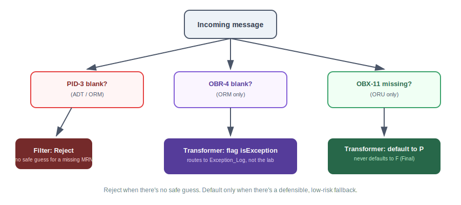

# Part 4: Filters and Transformers

**Prerequisite:** Parts 1–3 complete — Mirth Connect running in Docker, `Hospital_to_Lab_ADT_ORM` and `Lab_Receives_ADT_ORM` channels deployed, and all three message types (ADT, ORM, ORU) sent successfully for Jane Doe / order `ORD5001`.

---

## The concept

Everything through Part 3 proved the plumbing works: a message goes in one side, comes
out the other, unchanged. That's necessary, but it's not really what an interface analyst
spends most of the week doing. The real work is deciding **what gets through** and
**what needs fixing on the way** — and that's the job of two tabs you haven't touched
yet: **Filter** and **Transformer**.

They answer two different questions:

- **Filter** — a yes/no gate. Does this message get to continue past this point? No editing happens here.
- **Transformer** — runs only after the Filter says yes. This is where fields get defaulted, reformatted, or flagged for a human to look at.

> 💡 **Rule of thumb.** If you're deciding whether a message should exist downstream at
> all, that's a Filter question. If you're deciding what the message should look like
> once it's there, that's a Transformer question. Mixing the two into one script is how
> channels get unmaintainable fast.

Three specific problems come up constantly in real interface work — defects that parse
as perfectly valid HL7 and still cause real trouble downstream. Here's how each one gets
handled, and why:



| Field | Problem | Message type it affects |
|---|---|---|
| PID-3 (MRN) | Sometimes arrives empty | ADT, ORM |
| OBR-4 (Universal Service ID) | Sometimes arrives empty — an order with no test named on it | ORM |
| OBX-11 (Result Status) | Sometimes missing entirely — no way to tell preliminary from final | ORU |

Notice something: PID-3 and OBR-4 only ever show up on **ADT and ORM** messages — the
kind `Hospital_to_Lab_ADT_ORM` carries. OBX-11 only shows up on **ORU** messages — the
kind that lands on `Lab_Receives_ADT_ORM`. That split isn't a coincidence — it means the
filter/transformer work naturally divides across your two existing channels instead of
piling everything onto one.

---

## Step 1: Build a Filter on `Hospital_to_Lab_ADT_ORM`

This channel is the front door for anything the mock hospital sends. Two rules go here,
and both have to pass for a message to continue.

> ℹ️ **Where this actually lives in Mirth 4.5.2.** Filter and Transformer aren't
> sub-tabs inside Source like some versions show — they're their own links in the left
> **Channel Tasks** panel: **Edit Filter** and **Edit Transformer**.

1. Open **Hospital_to_Lab_ADT_ORM** → **Edit Filter**.
2. Click **Add New Rule** in the left **Filter Tasks** panel. Leave the type as **Rule
   Builder**, and set it to accept only when
   `msg['MSH']['MSH.9']['MSH.9.1'].toString()` **Equals** `'ADT'` or `'ORM'` —
   **include the single quotes around each value**.

> ⚠️ **Quote your string values.** Typing `ADT` and `ORM` into the Values list without
> quotes generates `== ADT` in the underlying script — a bare, undefined variable
> reference, not a string comparison. That throws `ReferenceError: "ADT" is not defined`
> and the message errors out instead of filtering. Always wrap text values in quotes
> (`'ADT'`, `'ORM'`) when using Rule Builder this way.

3. Click **Add New Rule** again. Set the **Field** to
   `msg['PID']['PID.3']['PID.3.1'].toString()`, choose condition **Not Equal**, and leave
   the **Values** list empty. Not Equal with nothing in the Values list means "not equal
   to blank" — i.e., PID-3 has to actually contain something to pass.

> ℹ️ **No raw JavaScript needed for this one.** Rule Builder's built-in "Not Equal"
> against an empty Values list handles the same "PID-3 must not be blank" check a custom
> script would. You can confirm this by clicking the **Generated Script** tab next to
> Rule, which should show `msg['PID']['PID.3']['PID.3.1'].toString() != ""`.

4. Set the operator between the two rules to **AND**, and leave the filter's default
   behavior on **Reject**. A message should have to earn its way through, not get through
   by default.
5. Save the channel, and consider clicking **Validate Filter** as a sanity check.

---

## Step 2: Build a Transformer on `Hospital_to_Lab_ADT_ORM`

Open **Edit Transformer** for the same channel. Two steps go here.

**Step 0 — Mapper: normalize PV1-44 (Admit Date/Time).**

1. Click **Add New Step**. Leave the type as **Mapper**.
2. **Variable:** `normalizedAdmitTime`
3. **Mapping:** `msg['PV1']['PV1.44']['PV1.44.1'].toString()`
4. **Add to:** Channel Map
5. Under **String Replacement**, click **New** and add:
   - **Regular Expression:** `/^(\d{8})(\d{6})$/`
   - **Replace With:** `'$1T$2'`

> ⚠️ **Two easy-to-miss syntax details here:**
> - **Include the enclosing slashes** on the Regular Expression — a bare pattern without
>   `/.../` delimiters is invalid JavaScript and fails **Validate Step**.
> - **Quote the Replace With value.** `$1T$2` without quotes throws a runtime
>   `ReferenceError` — even though **Validate Step** passes clean, since that check only
>   confirms the script is syntactically valid, not that every identifier actually
>   exists. Wrap it in quotes: `'$1T$2'`.

This reshapes a value like `20260615143000` into `20260615T143000` — a consistent
`YYYYMMDDTHHMMSS` format — using Mirth's built-in regex replacement instead of custom
code. Mirth generates this automatically:

```javascript
var mapping;
try {
    mapping = msg['PV1']['PV1.44']['PV1.44.1'].toString();
} catch (e) {
    mapping = '';
}
channelMap.put('normalizedAdmitTime', validate(mapping, '', new Array(new Array(/^(\d{8})(\d{6})$/, '$1T$2'))));
```

The `try/catch` is a safety net Mirth adds on its own: if PV1 is missing entirely —
which it will be on every ORM message, since orders don't carry visit info — this step
quietly stores an empty string instead of erroring out.

> 💡 **Why bother, if there's already *a* date in the field?** Different sending systems
> format timestamps slightly differently — with or without seconds, with or without a
> timezone offset. If every downstream system has to guess the shape, you get bugs that
> only show up occasionally. Normalizing once, in the engine, means everything after this
> point can rely on one format.

**Step 1 — JavaScript: flag a blank OBR-4.**

1. Click **Add New Step** again and set the type to **JavaScript**.
2. Paste in:

```javascript
if (msg['MSH']['MSH.9']['MSH.9.1'].toString() == 'ORM') {
    var serviceId = msg['OBR']['OBR.4']['OBR.4.1'].toString();
    if (serviceId == '') {
        channelMap.put('isException', true);
    }
}
```

> ⚠️ **Don't guess what the test was.** Unlike a date format, there's no defensible
> fallback value for a missing service ID. The only responsible move is to flag it for a
> human to resolve.

3. Save the channel, and consider **Validate Transformer** as a sanity check.

> 💡 **In plain terms:** Step 0 doesn't check for anything being empty — its only job is
> reformatting, with a quiet built-in fallback if the field's missing. Step 1 is the one
> doing actual detective work: it looks specifically at ORM messages and asks "is OBR-4
> blank?" And to be clear: **neither of these steps touches PID-3** — that check already
> happened back in the Filter.

---

## Step 3: Route flagged orders to an exception path

Right now, a flagged ORM would still sail straight through to the lab. Fix that by
giving flagged messages somewhere else to go instead.

1. On **Hospital_to_Lab_ADT_ORM**, go to the **Destinations** tab and click **New
   Destination**. Rename the new row to `Exception_Log`, and set its **Connector Type**
   to **JavaScript Writer**.
2. Give `Exception_Log` a script that logs the problem clearly enough for someone to act
   on later:

```javascript
logger.error('EXCEPTION - Missing OBR-4 (Universal Service ID). Message ID: ' + connectorMessage.getMessageId());
```

> ⚠️ **Don't add `return message;` here.** Unlike the Transformer's JavaScript step, the
> JavaScript Writer's script context has no `message` variable at all — adding
> `return message;` throws a runtime `ReferenceError`. This script's whole job is the
> side effect of logging; it doesn't need to return anything.

3. Open `Exception_Log`'s own **Edit Filter** (each destination has its own filter,
   separate from the channel-level Source filter). Add a rule: **Field**
   `channelMap.get('isException')`, condition **Equals**, value `true`.
4. Select the original TCP Sender destination and open its **Edit Filter**. Add the
   mirror-image rule: **Field** `channelMap.get('isException')`, condition **Not
   Equal**, value `true`. This way a flagged order never quietly reaches the lab — it
   goes to the log instead, not both places.
5. Save and redeploy the channel.

> 💡 **`isException` vs. `Exception_Log`, in plain terms:** `isException` is the channel
> map variable — a boolean flag set in the Transformer's Step 1, only for one condition
> right now: an ORM with a blank OBR-4. `Exception_Log` is the destination that *acts on*
> that flag — its own filter says "only continue if `isException` is true." When it does,
> it writes a detailed line to the server log so a human can go find and fix it.

---

## Step 4: Build a Transformer on `Lab_Receives_ADT_ORM`

This channel needs a Transformer step that catches the OBX-11 defect.

1. Open **Lab_Receives_ADT_ORM** → **Transformer** tab.
2. Add a **JavaScript step** that only acts on ORU messages, loops through every OBX
   segment, and defaults a blank *or missing* Result Status to `P`:

```javascript
if (msg['MSH']['MSH.9']['MSH.9.1'].toString() == 'ORU') {
    for (var i = 0; i < msg['OBX'].length(); i++) {
        var obx = msg['OBX'][i];
        if (obx['OBX.11'].length() == 0) {
            // OBX.11 doesn't exist at all - create it
            obx.appendChild(<OBX.11><OBX.11.1>P</OBX.11.1></OBX.11>);
        } else if (obx['OBX.11']['OBX.11.1'].toString() == '') {
            // OBX.11 exists but is blank
            obx['OBX.11']['OBX.11.1'] = 'P';
        }
    }
}
```

> ⚠️ **Two real bugs worth knowing about ahead of time:**
> - **`.length` needs parentheses.** In Mirth's E4X/Rhino scripting engine, an XMLList's
>   `length` is a **method**, not a plain property — `msg['OBX'].length()`, not
>   `msg['OBX'].length`.
> - **A missing field isn't the same as a blank one.** A message with no 11th field at
>   all has no `OBX.11` node to assign a value into — `obx['OBX.11']['OBX.11.1'] = 'P'`
>   silently does nothing when `OBX.11` doesn't exist yet; you have to explicitly create
>   the node first with `appendChild()`. **Validate Step** won't catch this — it only
>   checks the script parses, not that it behaves correctly against a message shaped like
>   your real test data.

> ⚠️ **P, never F.** Defaulting to `P` (Preliminary) is a safe, honest fallback — it
> tells the receiving system "unconfirmed, don't act on this yet." Defaulting to `F`
> (Final) would be a clinical claim about a result you have no basis to make.

3. Save and redeploy the channel.

> ⚠️ **Saving isn't deploying.** Any time you edit a Filter or Transformer, the channel
> needs to be **redeployed** before the change takes effect — Mirth keeps running
> whatever was last deployed, not what's sitting in the editor.

---

## Testing all three defects

The project's `hl7_practice_messages.md` file has three pairs built for exactly this —
one clean, one broken, per message type.

**Test the PID-3 filter:** send the empty-PID-3 ADT to `Hospital_to_Lab_ADT_ORM` — check
that its status reads **Filtered**, not Sent or Error.

**Test the OBR-4 exception path:** send the empty-OBR-4 ORM to
`Hospital_to_Lab_ADT_ORM` — check that the original TCP Sender destination shows
Filtered, and `Exception_Log` shows Sent.

**Test the OBX-11 default:** send the missing-OBX-11 ORU to `Lab_Receives_ADT_ORM` —
open the **Transformed** tab (not Raw) and confirm OBX-11 now reads `P` on both lines
even though the pasted message didn't have it.

---

With this in place, your two channels no longer just move messages — they make the same
judgment calls a real interface analyst makes constantly: reject what shouldn't
continue, fix what has a safe default, and flag what doesn't. That's the actual job.

**Next up: Part 5 — automating all of this with a Python/pytest test suite**, so these
checks run in seconds instead of by hand every time.
